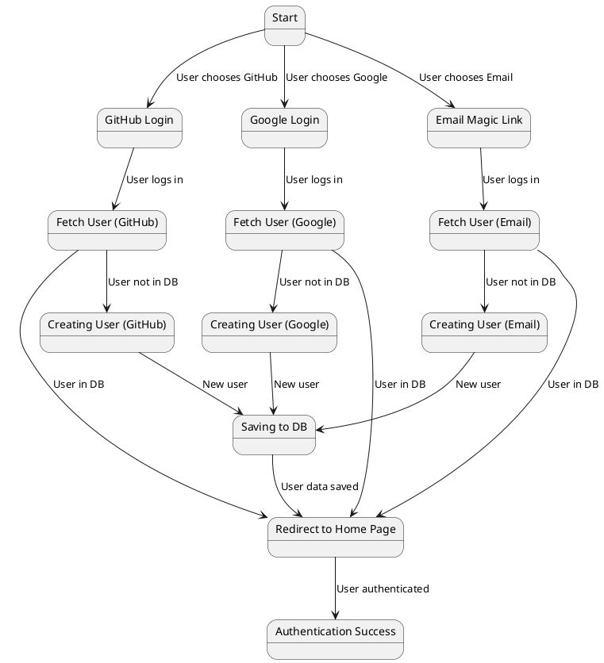

Descrizione del Diagramma:
Start: Stato iniziale quando l'utente arriva sulla pagina di login.

GitHub Login / Google Login / Email Magic Link: Stati intermedi per gestire l'autenticazione con i diversi provider.

Fetch User (GitHub) / Fetch User (Google) / Fetch User (Email): Stati intermedi per recuperare i dati dell'utente dal database.

Creating User (GitHub) / Creating User (Google) / Creating User (Email): Stati intermedi per creare un nuovo utente nel database se l'utente non esiste già.

Saving to DB: Stato in cui i dati dell'utente vengono inviati al server di database per il salvataggio.

Redirect to Home Page: Stato in cui l'utente viene reindirizzato alla home page dopo l'autenticazione.

Authentication Success: Stato finale che indica che l'utente è stato autenticato con successo.

Dettagli del Processo di Autenticazione:
L'utente inizia l'autenticazione scegliendo tra l'accesso tramite GitHub, Google o con un magic link via email.

Dopo aver effettuato l'accesso tramite il provider scelto o tramite il magic link, il sistema controlla se l'utente è già presente nel database.

Se l'utente esiste, viene effettuato il reindirizzamento alla home page.

Se l'utente non esiste, viene creato un nuovo profilo utente nel database.

I dati dell'utente (come nome utente, email, ID del provider esterno, ecc.) vengono salvati nel database.

Dopo il salvataggio nel database, l'utente viene reindirizzato alla home page.

Se l'utente è autenticato con successo, viene visualizzato uno stato di autenticazione riuscita.
