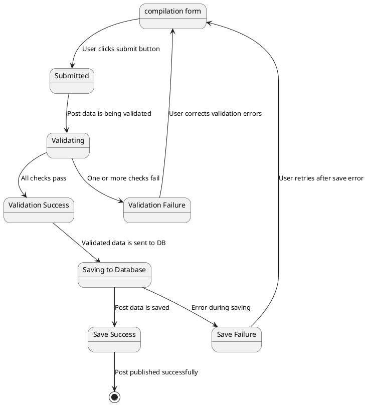

## Validazione e Salvataggio del Post

### Stati:
- **Start**
    - Stato iniziale quando l'utente compila il form per creare un nuovo post
    - L'utente ha inserito il titolo, il contenuto e i tag del post
  
- **submitted**
    - L'utente ha cliccato sul pulsante di invio per pubblicare il post

- **Validating**
    - Il sistema sta validando i dati del post (es. titolo, contenuto, eventuali tag).

- **Validation Success**
    - I dati del post sono stati validati correttamente.

- **Validation Failure**
    - La validazione dei dati del post ha fallito (es. campo obbligatorio mancante, lunghezza del titolo non valida).

- **Saving to Database**
    - Il sistema sta salvando i dati validati sul server di database.

- **Save Success**
    - I dati del post sono stati salvati correttamente sul server di database.

- **Save Failure**
    - Si è verificato un errore durante il salvataggio dei dati sul server di database (es. problemi di connessione, errore del server).

### Transizioni:
- **Start → Validating**
    - L'utente clicca sul pulsante di invio per pubblicare il post.

- **Validating → Validation Success**
    - I dati del post passano tutti i controlli di validazione.

- **Validating → Validation Failure**
    - I dati del post non superano uno o più controlli di validazione.

- **Validation Success → Saving to Database**
    - I dati validati del post vengono inviati al server di database per il salvataggio.

- **Validation Failure → Start**
    - L'utente corregge gli errori di validazione e riprova a inviare il post.

- **Saving to Database → Save Success**
    - I dati del post sono stati salvati correttamente sul server di database.

- **Saving to Database → Save Failure**
    - Si è verificato un errore durante il salvataggio dei dati sul server di database.

- **Save Failure → Start**
    - L'utente riprova a inviare il post dopo un errore di salvataggio.

- **Save Success → Success**
    - Il post è stato pubblicato con successo e l'utente viene reindirizzato alla pagina del post appena creato.
