## Macchina a Stati Finiti per il Comportamento dell'Utente in un Mini Blog

### Home Page
L'utente inizia sulla pagina principale, dove può visualizzare i post recenti. Da qui, le transizioni possibili sono:

-  l'utente vede la lista dei post recenti e può interagire con essi :
  - **Mettere "mi piace" al post**
     - Se l'utente è autenticato, può mettere "mi piace" al post.
  - **Salvare il post**
    - Se l'utente è autenticato, può salvare il post per una futura consultazione.
  - **Aggiungere un commento al post**
    - Se l'utente è autenticato, può lasciare un commento sul post.
     
- **Navigare alla pagina di un post specifico**
    - L'utente può cliccare su un post per vedere i dettagli completi di quel post.

- **Navigare alla pagina di autenticazione**
    - L'utente può cliccare sul pulsante di login per accedere o registrarsi.

- **Navigare alla pagina di creazione di un post**
    - Se l'utente è autenticato, può cliccare sul pulsante per creare un nuovo post.

- **Navigare alla pagina del profilo**
    - Se l'utente è autenticato, può cliccare sul proprio nome utente per vedere e modificare le informazioni del profilo.

### Post Page
Sulla pagina di un post specifico, l'utente può visualizzare i dettagli del post. Le transizioni possibili includono:

- **Tornare alla pagina principale**
    - Cliccando sul logo o sul pulsante "Home".

- **Aggiungere un commento al post**
    - Se l'utente è autenticato, può lasciare un commento.

### Authentication Page
Sulla pagina di autenticazione, l'utente può effettuare l'accesso o registrarsi. Le transizioni possibili sono:

- **Rindirizzamento automatico alla pagina principale**
    - Se l'utente è già autenticato, viene reindirizzato alla pagina principale.

- **Tornare alla pagina principale**
    - Cliccando sul logo o sul pulsante "Home".

- **Navigare alla pagina principale come utente autenticato**
    - Dopo aver effettuato con successo l'accesso o la registrazione, l'utente viene reindirizzato alla pagina principale.

### Create Post Page
Quando l'utente arriva sulla pagina di creazione di un post,se non è autenticato, viene reindirizzato alla pagina di autenticazione. Le transizioni possibili includono:

- **Rindirizzamento automatico alla pagina di autenticazione**
    - Se l'utente non è autenticato, viene reindirizzato alla pagina di autenticazione.
  
- **Tornare alla pagina principale**
    - Cliccando sul logo o sul pulsante "Home".

- **Navigare alla pagina del post appena creato**
    - Dopo aver inviato con successo un nuovo post, l'utente viene reindirizzato alla pagina del post appena creato.

### Profile Page
Sulla pagina del profilo, l'utente può visualizzare e modificare le proprie informazioni di profilo. Le transizioni possibili includono:
- 
- **Rindirizzamento automatico alla pagina di autenticazione**
  - Se l'utente non è autenticato, viene reindirizzato alla pagina di autenticazione.

- **Tornare alla pagina principale**
    - Cliccando sul logo o sul pulsante "Home".

- **Navigare alla pagina di un post specifico**
    - Cliccando su un post salvato o apprezzato per vedere i dettagli completi di quel post.

```plantuml
@startuml
title Mini Blog Finite State Machine
state "Home" as home {
  state "View Recent Posts" as view_posts
  state "Navigate to Post Page" as navigate_post
  state "Navigate to Authentication Page" as navigate_auth
  state "Navigate to Create Post Page" as navigate_create
  state "Navigate to Profile Page" as navigate_profile
}
state "Post Page" as post {
  state "View Post Details" as view_post
  state "Add Comment" as add_comment
}
state "Authentication Page" as auth {
  state "Redirect to Home Page" as redirect_home
  state "Navigate to Home Page" as navigate_home
  state "Navigate to Home Page (Authenticated)" as navigate_home_auth
}
state "Create Post Page" as create {
  state "Redirect to Authentication Page" as redirect_auth
  state "Navigate to Home Page" as navigate_home
  state "Navigate to Post Page" as navigate_post
}
state "Profile Page" as profile {
  state "Redirect to Authentication Page" as redirect_auth
  state "Navigate to Home Page" as navigate_home
  state "Navigate to Post Page" as navigate_post
}
home --> view_posts : View Recent Posts
home --> navigate_post : Navigate to Post Page
home --> navigate_auth : Navigate to Authentication Page
home --> navigate_create : Navigate to Create Post Page
home --> navigate_profile : Navigate to Profile Page
post --> view_post : View Post Details
post --> add_comment : Add Comment
auth --> redirect_home : Redirect to Home Page
auth --> navigate_home : Navigate to Home Page
auth --> navigate_home_auth : Navigate to Home Page (Authenticated)
create --> redirect_auth : Redirect to Authentication Page
create --> navigate_home : Navigate to Home Page
create --> navigate_post : Navigate to Post Page
profile --> redirect_auth : Redirect to Authentication Page
profile --> navigate_home : Navigate to Home Page
profile --> navigate_post : Navigate to Post Page
@enduml
```

