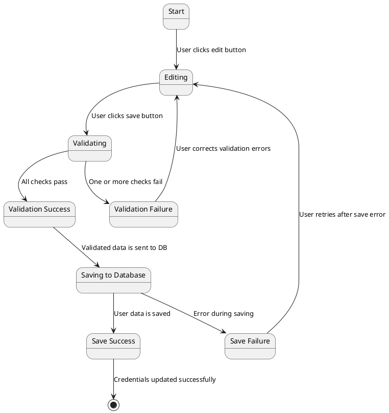

## Modifica dei Dati dell'Utente

### Stati:
- **Start**
    - Stato iniziale quando l'utente arriva sulla pagina del profilo.

- **Editing**
    - L'utente sta modificando le proprie credenziali (es. username, password, email).

- **Validating**
    - Il sistema sta validando i nuovi dati dell'utente.

- **Validation Success**
    - I nuovi dati dell'utente sono stati validati correttamente.

- **Validation Failure**
    - La validazione dei nuovi dati dell'utente ha fallito (es. formato email non valido, password troppo corta).

- **Saving to Database**
    - Il sistema sta salvando i dati validati sul server di database.

- **Save Success**
    - I dati dell'utente sono stati salvati correttamente sul server di database.

- **Save Failure**
    - Si è verificato un errore durante il salvataggio dei dati sul server di database (es. problemi di connessione, errore del server).

### Transizioni:
- **Start → Editing**
    - L'utente clicca sul pulsante per modificare le credenziali.

- **Editing → Validating**
    - L'utente clicca sul pulsante di salvataggio per aggiornare le credenziali.

- **Validating → Validation Success**
    - I nuovi dati dell'utente passano tutti i controlli di validazione.

- **Validating → Validation Failure**
    - I nuovi dati dell'utente non superano uno o più controlli di validazione.

- **Validation Success → Saving to Database**
    - I dati validati dell'utente vengono inviati al server di database per il salvataggio.

- **Validation Failure → Editing**
    - L'utente corregge gli errori di validazione e riprova a inviare i nuovi dati.

- **Saving to Database → Save Success**
    - I dati dell'utente sono stati salvati correttamente sul server di database.

- **Saving to Database → Save Failure**
    - Si è verificato un errore durante il salvataggio dei dati sul server di database.

- **Save Failure → Editing**
    - L'utente riprova a inviare i dati dopo un errore di salvataggio.

- **Save Success → Success**
    - Le credenziali sono state aggiornate con successo e l'utente riceve una conferma.
